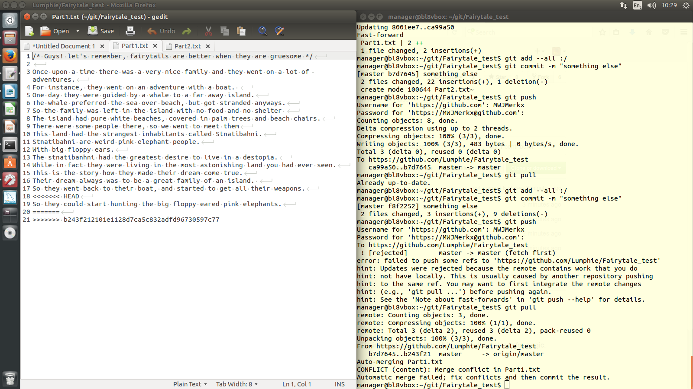
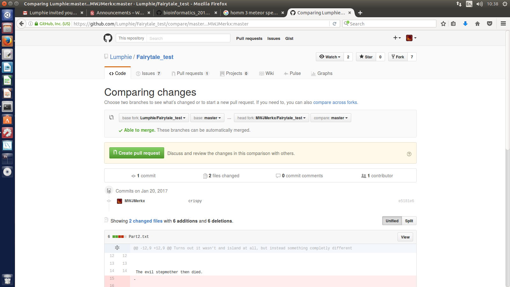
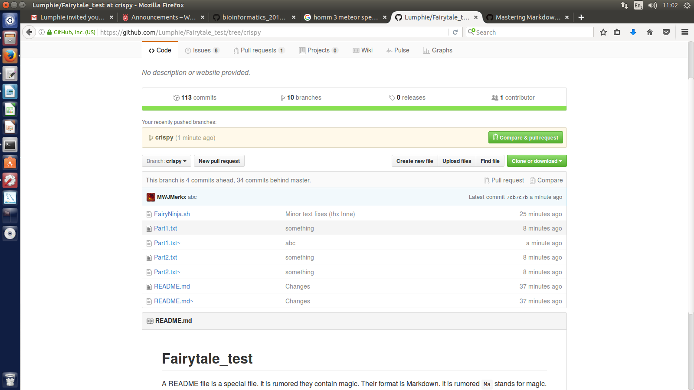
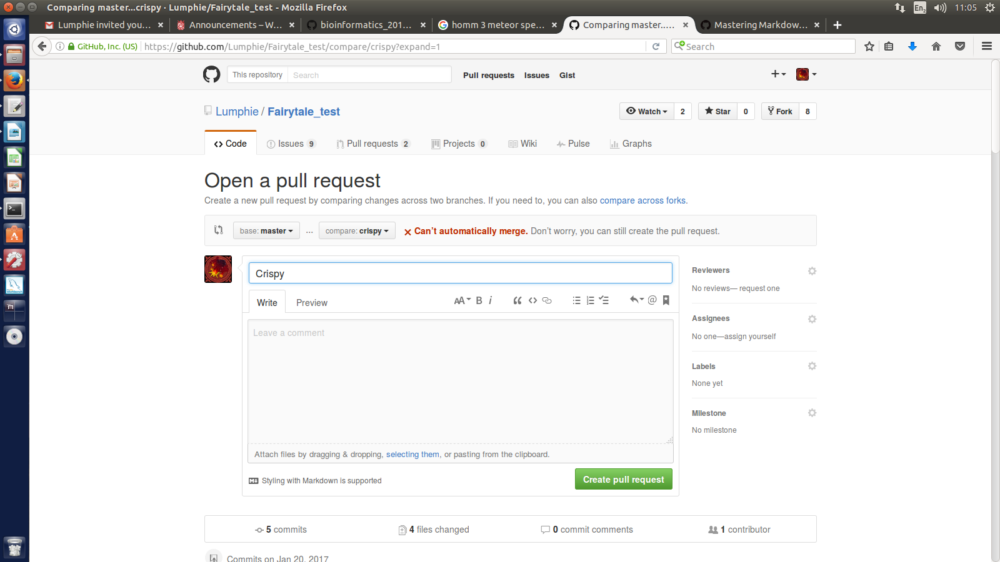

##I would like a 7-8 pretty please.

#made an issue on https://github.com/Lumphie/Fairytale_test
#accepted invitation to collaborate on https://github.com/Lumphie/Fairytale_test
#closed issue

#cloned repository

#eddited part 1
#pushed part 1 back with comment "version something"

#updated profile picture

#fixed merge conflict

#Create fairytale_test fork

#edited part two and created pull request

#accepted pull request

#made a branch "crispy"

#fixed merge errors "crispy"

#pull request and merge "crispy" with "master"

#created an issue on a repository I'm not a collaborator of

#Following other people

#added file from pullrequest

